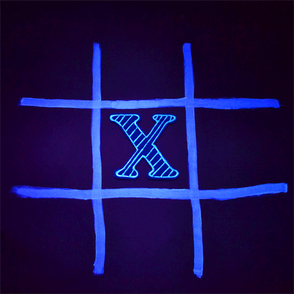

# Tic-Tac-Toe

---
## В данном проекте участие принимали два человека. 
>### 1. Борис Лукашенок

>### 2. Даниил Шкляев
---
## Наши крестики-нолики включают в себя:
>- ## Рейтинг и его изменение для каждого пользователя
>> ### Таблица информации с победами и поражениями пользователя
>- ## Жеребьевку первого хода и вариации бота для игры против пользователя
>> ### Всего существует две вариации бота:
>>> #### 1. Бот с ИИ, который учитывает ходы пользователя, анализирует все возможные ходы пользователя и себя самого для того, чтобы выстроить правильную стратегию, которая приведет к неминуемой победе бота или же ничьей в худшем случае. Такой бот не способен проиграть пользователю.
>>> #### 2. Бот без ИИ, основанный на рандоме. Ходит в пустые ячейки вне зависимости от предыдущих ходов как себя, так и пользователя. Выиграть такого бота не составит никакого труда.
>> ### Первый ход определяется на основании рандома.
>>> #### 1. Если первый ход за пользователем - он волен выбирать любую свободную ячейку.
>>> #### 2. Если же первый ход за ботом - он на основании рандома выбирает ячейку, в которую пойдет.
>- ## Таблицу с информацией о текущем сеансе игры
>> ### Она включает в себя:
>>> #### 1. Рейтинг с победами и поражениями пользователя
>>> #### 2. Приветствие при старте игры
>>> #### 3. Информацию о том, какой бот был активирован
>>> #### 4. Вежливое пожелание "Приятной игры"
>>> #### 5. Просьбу не жульничать при попытке пользователя наступить на уже занятую ячейку
>>> #### 6. Побуждение к действиям после хода бота
>>> #### 7. И самое главное - результат финала игры. Победа, ничья или же поражение
>- ## Дизайн оформленный в стиле Нового Года
>> ### Для необходимого нам оформления использована библиотека emoji. https://pypi.org/project/emoji/ <-- Вот ссылка на нее.
>>> #### 1. В качестве пустых ячеек мы использовали подарочные коробочки
>>> #### 2. В качестве символов пользователя использованы снежинки
>>> #### 3. А бот ходит символами-звездочками

# Перейдем к демонстрации того, как выглядит непосредственно в Telegram процесс игры.

## На данном скриншоте - самое начало
>- Можно заметить то, что рейтинг изначально нулевой
>- При приветствии использовано имя пользователя
>- Уведомление о том, какой бот был активирован для текущего сеанса игры
>- Пожелание "Приятной игры"
>>
---

## Следующий скриншот показывает сам процесс игры
>- До сих пор игра не завершена, поэтому рейтинг не изменился
>- Предыдущие записи были изменены, теперь мы можем заметить побуждение к действию
>- А так же уведомление о том, теперь очередь пользователя совершить ход
>>
---

## На этом же скриншоте мы видим финал игры
>- Так как пользователь победил - рейтинг изменился. Количество побед теперь - 1
>- Уведомление о том, что пользователь победил, используется имя пользователя
>- Пользователя хвалим за победу
>- Так же можем заметить, что появились две новые кнопки с вопросом, нажав на которые мы начнем новую игру, либо же завершим ее в зависимости от выбора пользователя 
>>
---

## В случае если пользователь выберет завершение игры
>- Поступит информация, где мы благодарим пользователя за игру и желаем удачи
>>
---

## В случае, если пользователь захочет сыграть еще раз
>- Старое поле удалится, а место него появится новое
>- Так как игра начинается новая - жеребьевка будет переопределена для нового сеанса игры. Т.е. может активироваться другая версия бота или же изменится очередность первого хода
>- При этом достижения пользователя будут учтены
>>
---

## Если пользователь проиграет
>- Рейтинг изменится, и к поражениям добавится + 1
>- Появится информация о том, что пользователь проиграл с грустным смайлом, так как мы расстроены этим фактом
>- Но так же и поддержка с предложением попробовать еще раз
>>
---

## Если пользователь захочет понять, что это за бот
>- Мы покажем информацию о том, что это - крестики-нолики
>>
---

## Мы храним достижения пользователя
>- Его статистику и время последней игры
>>
---

## У нас подключена система логирования всего, что происходит
>- Мы можем узнать когда тот или иной пользователь запустил игру
>- Время начала работы программы и время окончания ее соответственно
>>

